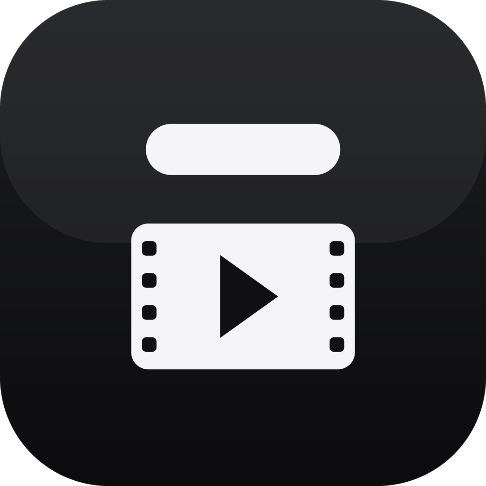
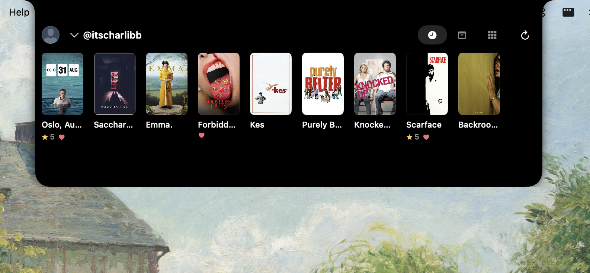
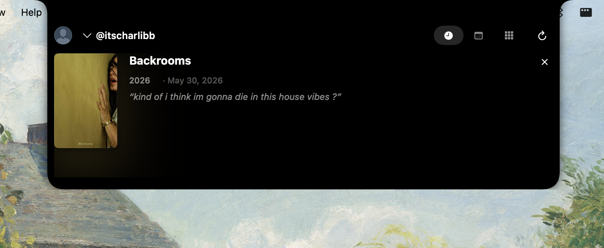
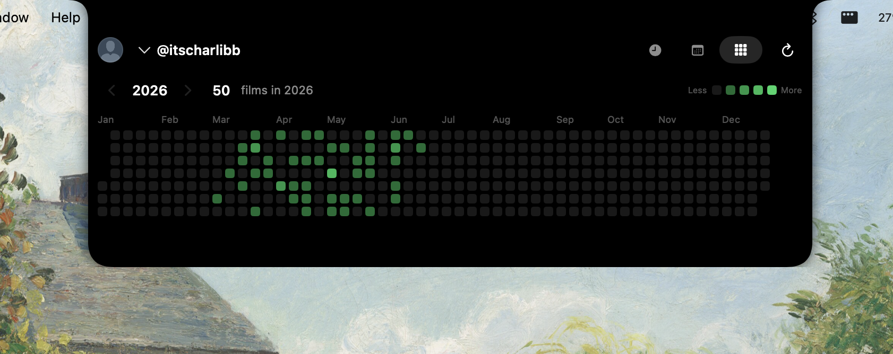
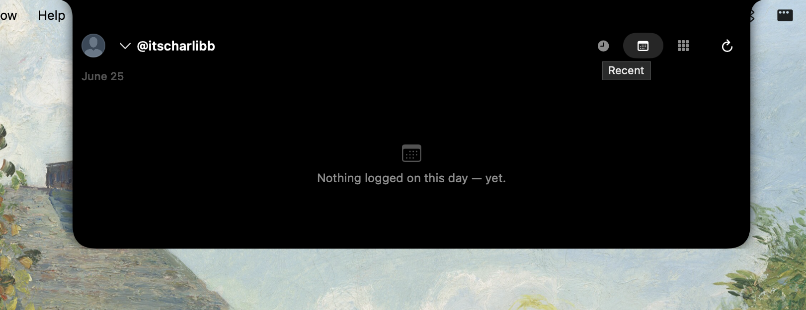

<p align="center">
  
</p>

<h1 align="center">Mise</h1>

<p align="center"><b>Your Letterboxd diary, living in the notch.</b></p>

Mise is a native macOS app that turns the empty space around your MacBook's
notch into a glanceable, Dynamic-Island-style companion for
[Letterboxd](https://letterboxd.com). Click the notch, and a panel slides open
with your recently watched films, an "on this day" rewind, and a GitHub-style
heatmap of everything you've logged this year. No browser tab, no app to switch
to — just your film life, one click away.

> The name comes from *mise-en-scène*. Free, open source, and quietly obsessed
> with movies.

**Unofficial — not affiliated with, endorsed by, or sponsored by Letterboxd.**

---

## Screenshots

| | |
|---|---|
|  <br> *Recently watched — a wall of poster art with your ratings.* |  <br> *Tap a film for its synopsis (or your own review).* |
|  <br> *A year of films watched, with a year switcher.* |  <br> *What you logged on this date in past years.* |

---

## What it does

Mise lives in the notch as a menu-bar agent (no Dock icon). Click to expand a
translucent panel with three glanceable sections:

- **Recently watched** — a horizontal strip of your latest diary entries, each
  with its poster and your star rating. Tap any poster for a smooth transition
  into a detail view: a larger poster alongside a TMDB synopsis, runtime, genres,
  and the date you watched it.
- **On this day** — every film you logged on today's date in years past, newest
  first. A small daily rewind of your own taste.
- **Contribution heatmap** — a GitHub-style grid of films watched per day across
  a full calendar year, with a `‹ year ›` switcher. Hover any cell for the date
  and count. Always reads January-on-the-left so the shape of your year is easy
  to compare to the last.

## Features

- **Three glanceable panels** — Recently watched, On this day, and the films
  heatmap, all in one expandable notch panel.
- **Profile switcher** — type a public Letterboxd username in Settings, or click
  the name to jump between recently viewed profiles. Watch your own diary, or a
  friend's.
- **Menu-bar agent** — runs as a background agent with no Dock icon. A small
  menu-bar item shows who you're viewing and offers Open, Sync now, Settings,
  and Quit.
- **Posters and synopses via TMDB** — supply your own (free) TMDB API key for
  poster art and film synopses. Without one, films appear as title + year.
- **Cached and offline-friendly** — your diary is cached locally and shown
  instantly on launch, then refreshed in the background.
- **Launch at login** — set Mise to start with your Mac so the notch is always
  ready. (Enable from Settings.)

## Install

1. Download the latest notarized DMG from the
   **[Releases page](https://github.com/IvanKuria/mise/releases/latest)**.
2. Open the DMG and drag **Mise** to your Applications folder.
3. Launch it. Mise appears in the menu bar (look for the film icon) — there is
   no Dock icon by design.
4. Open Settings and enter your public Letterboxd username to get started.

Requires **macOS 14 (Sonoma) or later**. Designed for MacBooks with a notch;
on non-notch displays the panel anchors to the top of the screen.

## Build from source

Mise is a SwiftUI + AppKit app, structured as an Xcode project generated with
[XcodeGen](https://github.com/yonaskolb/XcodeGen).

```sh
# 1. Install XcodeGen (once)
brew install xcodegen

# 2. Generate the Xcode project
cd App
xcodegen generate

# 3. Open and build the "Mise" scheme
open Mise.xcodeproj
# then select the Mise scheme and Run (⌘R)
```

The project pulls in the local Swift packages under `Packages/` automatically.

**Repository layout**

```
App/
  project.yml          XcodeGen spec for the Mise app target
  Sources/             SwiftUI + AppKit app: notch window, panels, menu bar
Packages/
  MiseCore/            Pure domain model value types (the shared contract)
  LetterboxdScrape/    Public RSS + polite HTML reader for Letterboxd
  FilmEnrichment/      Matches films to metadata providers
  TMDBKit/             TMDB client (posters, synopses)
  AppCore/             App-level orchestration / library controller
  LocalStore/          Local cache of watch history
docs/                  Documentation and screenshots
```

**Try it without a profile:** launch with `MISE_DEMO=1` set, or enter the
username `demo`, to load bundled sample data.

## Configuration

Open **Settings** from the menu-bar item:

- **Letterboxd username** *(required)* — any **public** Letterboxd handle. No
  password, no OAuth, no login. Mise reads what that profile already shows the
  world.
- **TMDB API key** *(optional)* — paste a free API key from
  [The Movie Database](https://www.themoviedb.org/settings/api) to enable poster
  art and synopses. Without it, Mise still works; films just render as title +
  year and the detail view shows your review (if any) instead of a synopsis.

Both values are stored locally on your Mac (see Privacy). Use **Sync now** from
the menu bar or Settings to refresh on demand.

## Privacy

Mise is built to be quiet and respectful:

- It reads **only public profile data**, primarily via the member's public
  Letterboxd **RSS feed** (with a light, polite, page-capped HTML read as a
  fallback). It never logs in and never asks for your Letterboxd password.
- There is **no account and no login** — for Mise or for Letterboxd.
- Your watch history is **cached locally** on your Mac. Nothing is uploaded to
  any Mise server (there isn't one).
- Your **TMDB key stays in UserDefaults on your Mac** and is used only to call
  TMDB directly for posters and synopses.

## Limitations

- **The notch hides under fullscreen apps.** When another app takes over the
  full screen, macOS covers the notch area, so the Mise panel isn't reachable
  until you leave fullscreen.
- **Only the publicly-visible recent diary is available.** Without login, Mise
  can see what a public profile exposes through its RSS feed and pages — your
  full rated library and private entries are not accessible. The heatmap and
  panels reflect the recent, public diary, not your entire watch history.
- TMDB-dependent features (posters, synopses) require your own API key.

## Credits & disclaimers

- **Unofficial — not affiliated with, endorsed by, or sponsored by Letterboxd.**
  Letterboxd is a trademark of its respective owner.
- **This product uses the TMDB API but is not endorsed or certified by TMDB.**
  The TMDB logo accompanies this attribution inside the app.
- Film data and posters are provided by [The Movie Database (TMDB)](https://www.themoviedb.org/).
- HTML parsing uses [SwiftSoup](https://github.com/scinfu/SwiftSoup).
- The notch interaction draws inspiration from open-source notch projects such
  as `boring.notch`; the implementation here is original and MIT-licensed.

## License

Released under the [MIT License](LICENSE). Copyright (c) 2026 Ivan Kuria.
